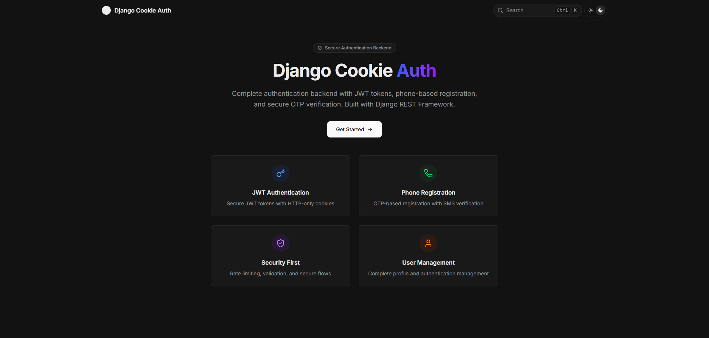

# Django Cookie Authentication System

A comprehensive full-stack authentication system featuring Django REST Framework backend with JWT cookie-based authentication, complete with professional API documentation.



## 🚀 Features

### Backend (Django)
- **JWT Cookie Authentication** - Secure HTTP-only cookies for token storage
- **Phone Number & OTP Authentication** - SMS-based verification system
- **Password Authentication** - Traditional email/password login
- **Forgot Password Flow** - Complete password reset with OTP verification
- **User Management** - Registration, login, logout, profile management
- **Token Refresh** - Automatic token renewal without exposing tokens
- **CORS Support** - Ready for frontend integration

### Documentation (Next.js)
- **Interactive API Docs** - Complete endpoint documentation with examples
- **TypeScript Interfaces** - Full type definitions for all API responses
- **Modern UI** - Clean, responsive documentation interface
- **Live Examples** - Real request/response samples
- **Search Functionality** - Quick navigation through documentation

## 📁 Project Structure

```
├── backend/          # Django REST API
│   ├── apps/
│   │   ├── account/     # User authentication & management
│   │   └── sms_service/ # OTP & SMS handling
│   ├── config/          # Django settings & API configuration
│   └── requirements.txt
├── docs/             # Next.js documentation site
│   ├── content/docs/    # MDX documentation files
│   ├── app/            # Next.js app structure
│   └── package.json
├── next/             # (Reserved for future frontend)
├── nuxt/             # (Reserved for future frontend)
└── shots/            # Screenshots
```

## 🚀 Quick Start
### Backend Setup

1. **Clone and Navigate**
  ```bash
  git clone https://github.com/taymakz/django-cookie-auth.git
  cd django-cookie-auth/backend
  ```

2. **Create Virtual Environment**

  - **On Windows:**
    ```bash
    py -m venv venv
    venv\Scripts\activate
    ```
  - **On macOS/Linux:**
    ```bash
    python3 -m venv venv
    source venv/bin/activate
    ```

3. **Install Dependencies**
  ```bash
  pip install -r requirements.txt
  ```

4. **Environment Setup**
  ```bash
  # Create .env file
  cp .env.example .env
  # Edit .env with your settings
  ```

5. **Database Setup**
  ```bash
  python manage.py migrate
  ```

6. **Run Development Server**
  ```bash
  python manage.py runserver
  ```

### Documentation Setup


1. **Navigate to Docs**
   ```bash
   cd ../docs
   ```

2. **Install Dependencies**
   ```bash
   npm install
   # or
   pnpm install
   ```

3. **Run Documentation**
   ```bash
   npm run dev
   # or
   pnpm dev
   ```

4. **View Documentation**
   Open [http://localhost:3000](http://localhost:3000)

## 📋 API Endpoints

### Authentication
| Method | Endpoint | Description | Auth Required |
|--------|----------|-------------|---------------|
| `POST` | `/api/account/authenticate/check/` | Check user existence | ❌ |
| `POST` | `/api/account/authenticate/password/` | Login with password | ❌ |
| `POST` | `/api/account/authenticate/otp/` | Login/register with OTP | ❌ |
| `POST` | `/api/account/authenticate/token-refresh/` | Refresh JWT token | ❌ |
| `GET` | `/api/account/authenticate/current/` | Get current user | ✅ |
| `POST` | `/api/account/authenticate/logout/` | Logout user | ✅ |

### Password Reset
| Method | Endpoint | Description | Auth Required |
|--------|----------|-------------|---------------|
| `POST` | `/api/account/authenticate/forget-password/check/` | Start password reset | ❌ |
| `POST` | `/api/account/authenticate/forget-password/otp/` | Verify reset OTP | ❌ |
| `POST` | `/api/account/authenticate/forget-password/reset/` | Reset password | ❌ |

### OTP Management
| Method | Endpoint | Description | Auth Required |
|--------|----------|-------------|---------------|
| `POST` | `/api/sms-service/request/otp/` | Request/resend OTP | ❌ |


## 🤝 Contributing

1. Fork the repository
2. Create a feature branch: `git checkout -b feature-name`
3. Make your changes
4. Update documentation if needed
5. Test your changes
6. Commit: `git commit -m 'Add feature-name'`
7. Push: `git push origin feature-name`
8. Create a Pull Request

## 📄 License

This project is licensed under the MIT License - see the LICENSE file for details.

